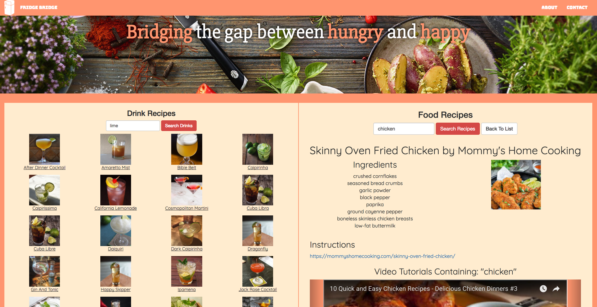

# Fridge Bridge

Fridge Bridge is a food and drink recipe application which incorporates Youtube, Yummly, and CocktailDB APIs

### Notes
- Combined 3 **external** resources via AJAX requests and presented their information
- Documented by JSDOC standards
- Issue-managed via meistertask 

###Developers

Created by three developers as part of a Hackathon at Learning Fuze

[Krystal Enojado](https://github.com/kryseno)
[Prosith Khiev](https://github.com/pk316)
[Peter Woo](https://github.com/oowretep)